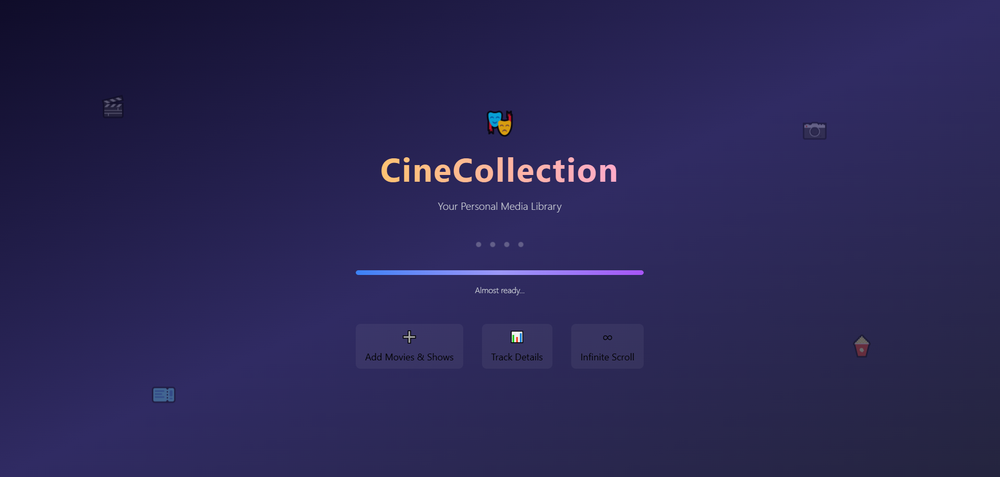
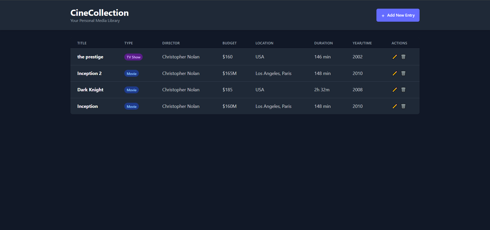
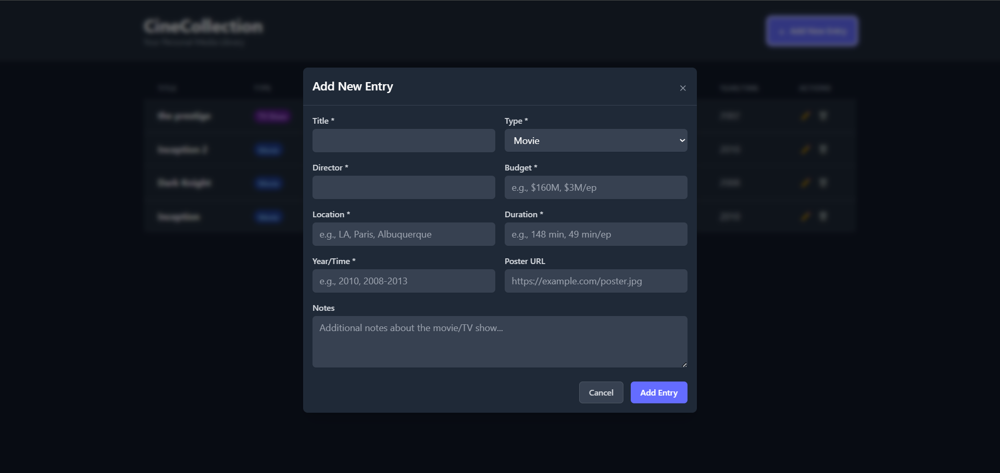
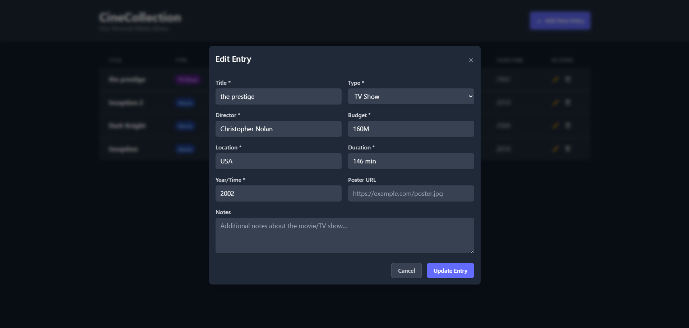
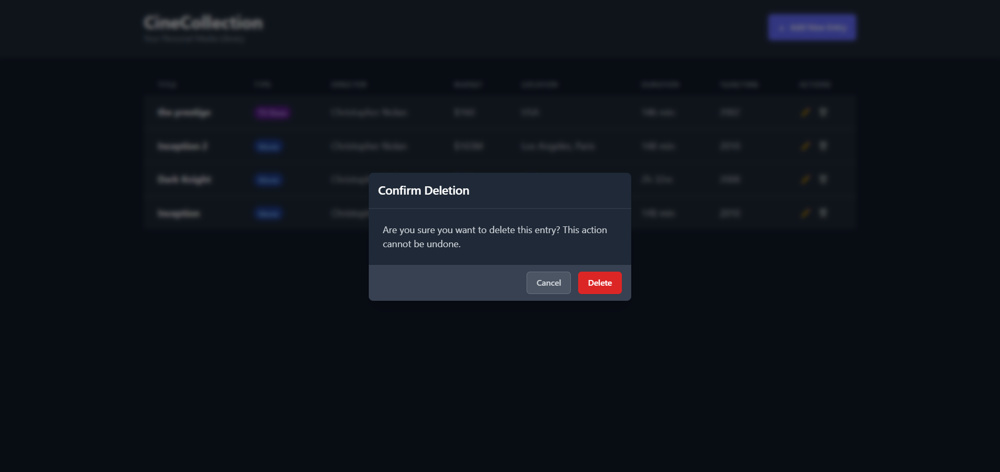

# Favorite Movies & TV Shows Web Application

A full-stack web application that allows users to manage their favorite movies and TV shows — featuring add, edit, delete, and infinite scrolling capabilities.

---

## Overview

This project demonstrates a complete **React + Node.js + MySQL** stack application with a clean architecture.  
It includes separate frontend and backend modules with their own setup guides and documentation.

---


## Tech Stack

### Frontend
- React 18 + Vite + TypeScript  
- Tailwind CSS  
- React Hook Form  
- Axios  
- Toast notifications  
- Infinite scroll table  
- Responsive & modern UI  

### Backend
- Node.js + Express  
- Prisma ORM (MySQL)  
- Zod validation  
- RESTful API structure  
- TypeScript  

---

## Core Features

✅ Add and manage favorite movies and TV shows  
✅ Infinite scroll table view  
✅ Edit and delete functionality with modals  
✅ Poster/image support  
✅ Responsive design with dark mode  
✅ Real-time toast feedback  

---

## Getting Started

Clone the repository and follow the setup steps in each folder:

```bash
# Clone the main repository
git clone https://github.com/ArunKumar-7121/favorite-movies-app.git
cd favorite-movies
```bash

## Screenshots

### Splash Screen


### Home Screen


### Add Movie


### Edit Movie


### Delete Movie

